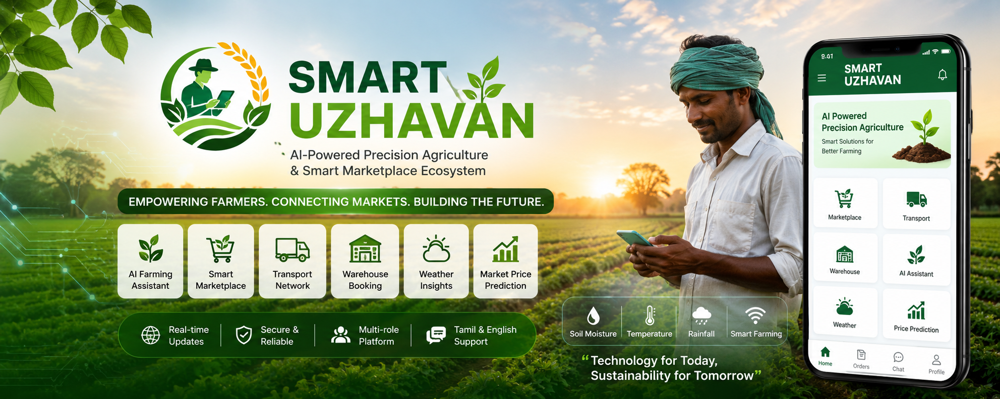

# 🌱 SMART UZHAVAN
SMART UZHAVAN is an AI-powered precision agriculture and marketplace mobile app built using Flutter &amp; Firebase. It connects farmers, buyers, transporters, and warehouse owners with smart crop trading, logistics, weather insights, AI assistance, and real-time agriculture services.
## AI-Powered Precision Agriculture & Smart Marketplace Ecosystem

<p align="center">
  
</p>

<p align="center">
  <b>Empowering Farmers Through AI, Automation & Real-Time Digital Agriculture</b>
</p>

<p align="center">


</p>

---

# 📖 About The Project

**SMART UZHAVAN** is a next-generation AI-powered agriculture ecosystem mobile application developed to digitally transform farming operations and agricultural supply chain management.

The application creates a unified smart platform where:

* 👨‍🌾 Farmers can sell crops directly
* 🛒 Buyers can purchase agricultural products
* 🚚 Transporters can manage logistics & deliveries
* 🏬 Warehouse Owners can provide storage services

This platform combines:

✅ AI-driven agriculture assistance
✅ Real-time marketplace workflows
✅ Smart logistics management
✅ Warehouse booking system
✅ Weather-based recommendations
✅ Precision agriculture concepts

to build a scalable digital farming ecosystem.

---

# 🎯 Problem Statement

Traditional agricultural systems face several challenges:

* Lack of direct farmer-to-buyer connectivity
* Poor transportation coordination
* Storage management difficulties
* Unpredictable market prices
* Limited technology accessibility for farmers
* Lack of real-time agricultural insights

SMART UZHAVAN solves these issues through an integrated mobile-first ecosystem powered by AI and cloud technologies.

---

# 🚀 Core Features

# 👨‍🌾 Farmer Module

### Features

* Crop upload & management
* AI-based crop suggestions
* Smart farming dashboard
* Weather alerts & recommendations
* Live crop demand visibility
* Market price prediction
* Multilingual farmer support
* Voice-friendly interaction system

### Benefits

✔ Better selling opportunities
✔ Direct customer reach
✔ Smart farming assistance
✔ Reduced middlemen dependency

---

# 🛒 Marketplace Module

### Features

* Crop browsing interface
* Real-time product feed
* Search & filter system
* Location-based crop discovery
* Add-to-cart functionality
* Order management
* Buyer booking workflow

### Benefits

✔ Faster crop purchasing
✔ Transparent pricing
✔ Direct farmer communication
✔ Real-time product availability

---

# 🚚 Smart Transport Module

### Features

* Ola/Uber-style booking flow
* Vehicle registration system
* Route-based pricing calculation
* Live booking management
* Transport request handling
* Trip status tracking

### Benefits

✔ Faster delivery coordination
✔ Smart logistics workflow
✔ Real-time transport availability
✔ Efficient delivery tracking

---

# 🏬 Warehouse Module

### Features

* Google Maps warehouse view
* Nearby warehouse discovery
* Storage slot booking
* Availability tracking
* Warehouse owner dashboard
* Real-time booking updates

### Benefits

✔ Better storage accessibility
✔ Reduced crop wastage
✔ Real-time warehouse visibility
✔ Smart storage management

---

# 🤖 AI-Powered Precision Agriculture

SMART UZHAVAN is designed with the vision of:

# “AI-Powered Precision Agriculture”

The system introduces intelligent agriculture support features including:

* 🌦 Weather-based farming advice
* 🌱 Crop health monitoring
* 🐛 Pest management concepts
* 💧 Soil moisture insights
* ☔ Rainfall-based irrigation planning
* 📈 Crop yield prediction ideas
* 🌾 Smart cultivation recommendations
* 🧠 AI farming assistant prototype

---

# 🛠 Technology Stack

| Technology              | Usage                             |
| ----------------------- | --------------------------------- |
| Flutter                 | Cross-platform mobile development |
| Dart                    | Application programming           |
| Firebase Authentication | Secure authentication             |
| Cloud Firestore         | Real-time cloud database          |
| Firebase Storage        | Media storage                     |
| Google Maps API         | Maps & location tracking          |
| Geolocator              | Live GPS access                   |
| AI Concepts             | Smart agriculture workflows       |

---

# 📱 Application Modules

## Authentication

* Login
* Registration
* Role-based access

## Farmer Features

* Crop posts
* Price prediction
* Smart suggestions

## Marketplace

* Crop listings
* Orders
* Cart system

## Warehouse

* Storage booking
* Nearby warehouses
* Map integration

## Transport

* Booking flow
* Trip management
* Vehicle management

## AI Features

* Weather insights
* Farming advice
* Precision agriculture UI

---

# 🔥 Real-Time Functionalities

SMART UZHAVAN uses Firebase Firestore to provide:

✅ Live marketplace updates
✅ Real-time order tracking
✅ Instant booking sync
✅ Dynamic warehouse availability
✅ Live transport status updates
✅ Multi-user workflow communication

---

# 🌍 Multilingual Support

The app is designed to be farmer-friendly with support for:

* 🇮🇳 Tamil
* 🇬🇧 English

This improves accessibility for rural and regional users.

---

# 🎨 UI/UX Design

The application follows a:

* Clean modern UI
* Agriculture-focused theme
* Mobile-first design approach
* User-friendly navigation system
* Card-based dashboard experience
* Real-time interactive layouts

---

# 📂 Project Structure

```bash
lib/
│
├── screens/
├── widgets/
├── services/
├── models/
├── firebase/
├── utils/
├── animations/
├── components/
└── main.dart
```

---

# ⚙️ Installation Guide

# 1️⃣ Clone Repository

```bash
git clone https://github.com/yourusername/smart-uzhavan.git
```

---

# 2️⃣ Open Project

```bash
cd smart-uzhavan
```

---

# 3️⃣ Install Packages

```bash
flutter pub get
```

---

# 4️⃣ Firebase Setup

Add your:

* `google-services.json`

inside:

```bash
android/app/
```

---

# 5️⃣ Configure Google Maps API

Inside:

```bash
android/app/src/main/AndroidManifest.xml
```

Add:

```xml
<meta-data
 android:name="com.google.android.geo.API_KEY"
 android:value="YOUR_API_KEY"/>
```

---

# 6️⃣ Run Application

```bash
flutter run
```

---

# 📸 Screenshots

## App UI Preview

```md
assets/screenshots/
```

### Suggested Screenshots

* Splash Screen
* Login Screen
* Farmer Dashboard
* Marketplace
* Transport Module
* Warehouse Map View
* AI Farming Assistant
* Weather Alerts
* Booking Workflow

---

# 📦 APK Included

The APK file is included in this repository for:

* Testing
* Demonstration
* Project showcase
* Recruitment portfolio review

---

# 📊 Key Highlights

✅ AI-Powered Agriculture Platform
✅ Real-Time Firebase Backend
✅ Multi-Role Ecosystem
✅ Precision Agriculture Concepts
✅ Google Maps Integration
✅ Marketplace + Logistics System
✅ Modern Mobile UI/UX
✅ Scalable Architecture Design

---

# 🧠 Skills Gained

This project provided strong hands-on experience in:

* Mobile App Development
* Flutter Architecture
* Firebase Integration
* Cloud Database Management
* Real-Time Systems
* State Management
* UI/UX Engineering
* Google Maps Integration
* End-to-End Product Development
* AI-Based Application Design

---

# 🚀 Future Enhancements

Planned future upgrades include:

* AI Disease Detection
* Drone Monitoring Integration
* IoT Smart Farming
* Voice-Controlled AI Assistant
* AI Yield Prediction
* Smart Irrigation Automation
* Push Notifications
* Payment Gateway
* ML-Based Market Forecasting

---

# 👨‍💻 Developed By

# Sudharshan

### Founder & Developer — ThinkCraft Studio

Focused on building scalable AI-powered mobile applications and impactful digital products.

---

# 🏢 About ThinkCraft Studio

ThinkCraft Studio is focused on:

* AI-based applications
* Mobile app development
* Real-time cloud systems
* Smart automation platforms
* Modern digital product engineering

---

# 🤝 Contributions

Contributions and suggestions are always welcome.

Feel free to:

* Fork the repository
* Create pull requests
* Suggest improvements

---

# 📄 License

This project is developed for:

* Educational purposes
* Innovation showcase
* Research & demonstration

---

# ⭐ Support The Project

If you found this project useful:

⭐ Star this repository
🍴 Fork the project
📢 Share it with others

---

# 🌱 SMART UZHAVAN

### Building the Future of AI-Powered Precision Agriculture.

